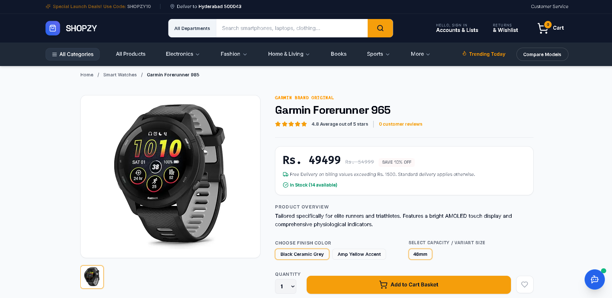
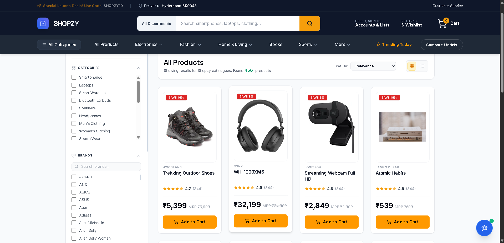

# 🛍️ Shopzy – AI Powered Full Stack E-Commerce Platform

Shopzy is a modern AI-powered full-stack e-commerce application built to provide an intelligent and seamless online shopping experience. The platform combines traditional e-commerce functionalities with AI-driven product recommendations, enabling users to discover products more efficiently and make informed purchasing decisions.

## 🚀 Features

### 👤 User Features

* User Registration and Login Authentication
* Secure JWT-Based Authorization
* Browse Products by Categories
* Product Search and Filtering
* Product Detail Pages
* Shopping Cart Management
* Order Placement and Tracking
* Responsive User Interface

### 🤖 AI-Powered Features

* AI-Based Product Recommendations
* Smart Shopping Assistance
* Personalized Product Suggestions
* Enhanced Product Discovery Experience

### 🛠️ Admin Features

* Admin Dashboard
* Product Management (Add, Update, Delete)
* Order Management
* User Management
* Inventory Monitoring
* Analytics Overview

## 🏗️ Tech Stack

### Frontend

* React 19, TypeScript, Vite, HTML5, CSS3

### Backend

* Node.js, Express.js

### Database

* MongoDB, Mongoose

### Authentication

* JSON Web Tokens (JWT)

### AI Integration

* Google Gemini AI

## 🎯 Key Highlights

* Full Stack E-Commerce Architecture
* AI-Powered Product Discovery
* Secure Authentication & Authorization
* Scalable Backend Design
* Responsive and User-Friendly Interface
* Real-World Shopping Workflow Implementation
* Admin Dashboard for Product and Order Management

## 📸 Project Screenshots

### 🏠 Home Page

### ⌚ Listing Page

### 🛒 All Products Page

### 🌐Website URL
https://shopzy-844756831111.asia-southeast1.run.app
